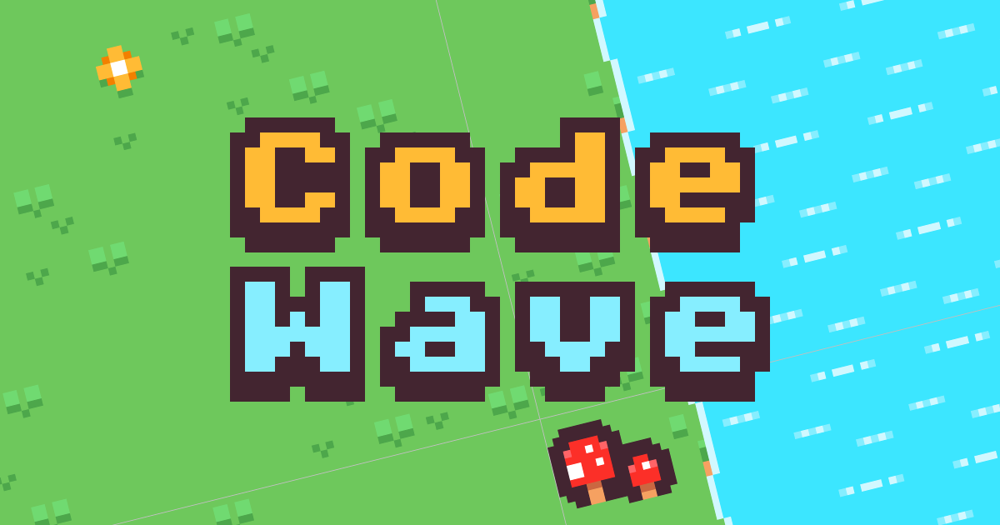

[](https://app.netlify.com/projects/code-wave-game/deploys)

<p align="center">
	<a href="https://cassidoo.itch.io/code-wave">Play Code Wave!</a>
</p>

---

A top-down 2D game where a player collects letters to form words while avoiding enemies.

A player, for each level, has to collect the letters of a word. Once they get all of the letters for a given level, they are able to cross a body of water to reach the next level. The "finish line" on each level is across the water, and once they cross it, they go to the next level.

The words for all 10 levels are as follows:

- AI
- Git
- Code
- Merge
- Commit
- Branch
- GitHub
- Program
- Copilot
- Developer

In addition to the word length getting longer for each level, the number of enemies also increases. There are bombs that remain stationary, and hovercrafts that move randomly around the map. If the player touches one, they are sent back to the start of the level.

Difficulty levels:

- **Easy**: User can get letters in any order, and enemies restart the level.
- **Medium**: User can get letters in any order, but enemies restart the level _and_ the player loses all of their letters.
- **Hard**: User has to get letters in correct order, and enemies restart the level _and_ the player loses all of their letters.

## Project Structure

This is a Phaser 3 project template that uses Vite for bundling. It supports hot-reloading for quick development workflow and includes scripts to generate production-ready builds.

```
src/game/
  ├── main.js              # Game configuration with physics
  ├── scenes/
  │   ├── Boot.js          # Initial asset loading
  │   ├── Preloader.js     # Main asset loading
  │   ├── MainMenu.js      # Main menu with Start and Help buttons
  │   ├── HowToPlay.js 	   # Learn how to play
  │   ├── Pause.js 	 	   # Paused screen
  │   ├── Game.js          # Core gameplay scene
  │   └── GameOver.js      # Victory screen
public/assets/maps/
	├── level1.tmj through level10.tmj  # Tiled map files
	└── sprites.png      # 16x16 sprite sheet (25x11 grid)
```

## Available Commands

| Command               | Description                                                                                              |
| --------------------- | -------------------------------------------------------------------------------------------------------- |
| `npm install`         | Install project dependencies                                                                             |
| `npm run dev`         | Launch a development web server                                                                          |
| `npm run build`       | Create a production build in the `dist` folder                                                           |
| `npm run dev-nolog`   | Launch a development web server without sending anonymous data (see "About log.js" below)                |
| `npm run build-nolog` | Create a production build in the `dist` folder without sending anonymous data (see "About log.js" below) |

The local development server runs on `http://localhost:8080` by default.

## Credits

Tech stack:

- **Phaser 3.90.0**
- **Vite 6.3.1**

Tools:

- **Tiled**: Map editor
- **Aseprite**: Pixel art
- **GitHub Copilot + VS Code**: Development

Assets:

- **Pixel art**:
  - [Kenney](https://kenney.nl/)
  - Mona character by [Cameron Foxly](https://github.com/cameronfoxly)
- **Music**:
  - (Licensed!) background track is A Heart of Pixels by [Christoffer Moe Ditlevsen](https://www.epidemicsound.com/artists/christoffer-moe-ditlevsen/)
  - Sound effects combo of Kenney and custom made
